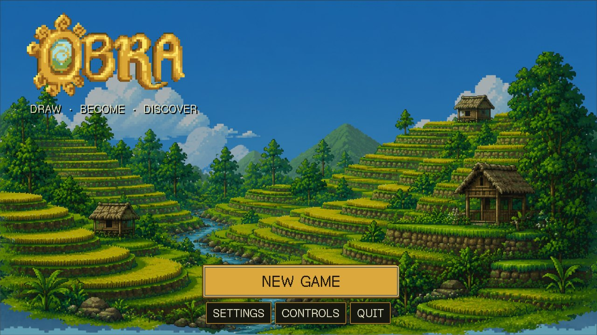
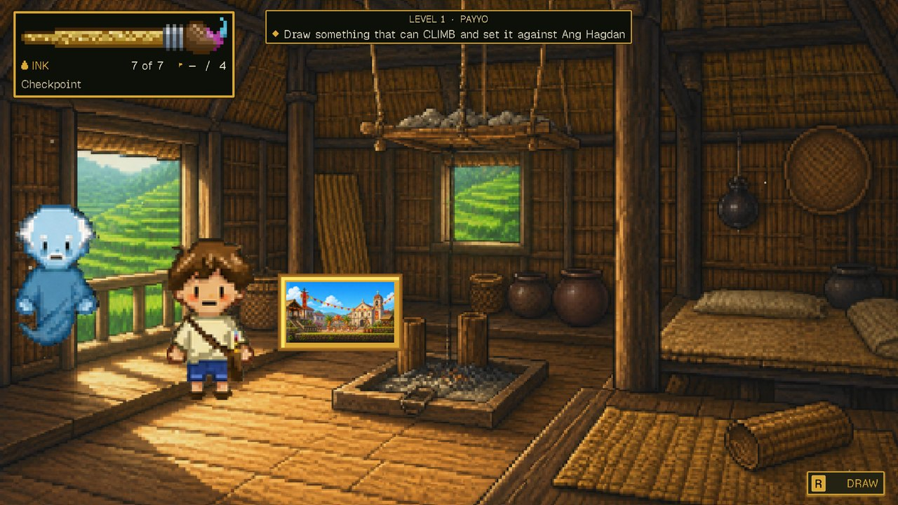
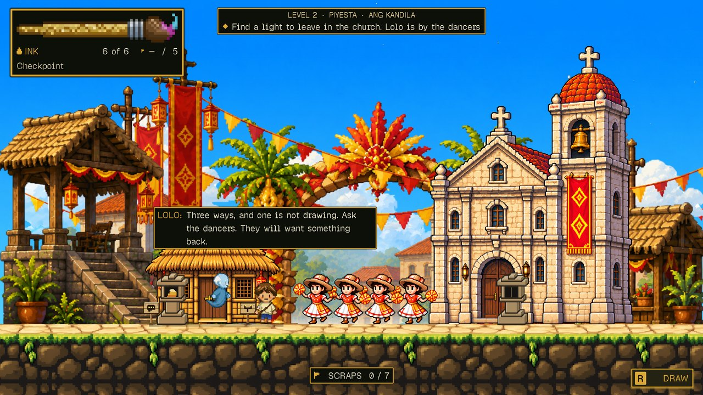
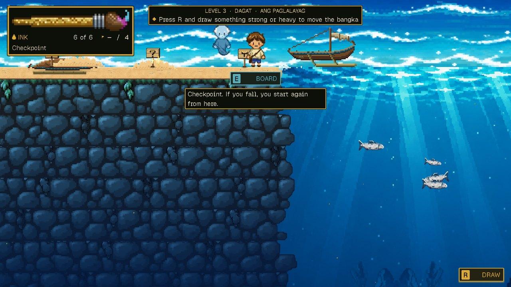

<h1 align="center">O.B.R.A.</h1>

<p align="center"><b>Draw · Become · Discover</b></p>

<p align="center">
	A 2D adventure game where what you draw comes to life.<br />
	Real-time drawing recognition with a CNN and ConceptNet: a Computer Science thesis project at the University of San Carlos.
</p>

<p align="center">
	
	
	
	
</p>

<p align="center">
	
</p>

<h3>About</h3>

- You are the apo. You pick up Lola's brush in her house, and one of her paintings pulls you in. Lolo, painted there long ago and not quite a ghost, walks with you; Lola left pieces of herself in every painting.
- Her brush still works in there. Draw, and the game recognises the sketch. It becomes real: a creature you play as, or an object you place, carry and use.
- Every obstacle has more than one answer, and what you draw to get past it is up to you.
- Set in the Philippines: the Ifugao rice terraces, a town fiesta, and the sea of the bakunawa.

<h3>Screenshots</h3>

<table>
	<tr>
		<td></td>
		<td></td>
		<td></td>
	</tr>
	<tr>
		<td align="center"><sub>Payyo</sub></td>
		<td align="center"><sub>Piyesta</sub></td>
		<td align="center"><sub>Dagat</sub></td>
	</tr>
</table>

<h3>How it works</h3>

- **Draw.** The canvas keeps your strokes as vectors as well as a picture.
- **Recognise.** A small CNN trained on Google's Quick, Draw! names the sketch (28 × 28, grayscale) out of **50 classes**: 20 creatures, 27 objects and 3 shapes. It runs on your computer, on ONNX Runtime behind FastAPI.
- **Only when sure.** Below 0.60 confidence, or within 0.15 of the runner-up, it declines and asks for another try. A declined drawing costs no ink.
- **Abilities.** What each class can do comes from ConceptNet, resolved offline into a table (`game/config/abilities.json`). The game never queries it at runtime.
- **Become.** A creature is a physics ragdoll built from your own strokes, walking, hopping, flying or swimming on motor-driven joints. An object is placed, turned, resized, carried and used.
- **Ink.** Every drawing spends from a small budget of ink, so what you draw matters.

<h3>Levels</h3>

| | |
|---|---|
| **Lola's house** | The hub. Each painting on the wall is a level. |
| **1 · Payyo** | The Ifugao rice terraces. The tutorial. |
| **2 · Piyesta** | A town plaza on the day of its fiesta. |
| **3 · Dagat** | The open sea, and the bakunawa beneath it. |
| **4 · Dilim, 5 · Mayon** | Still to be painted. |

<h3>Built with</h3>

<h4>Game</h4>
<p>
	
	
</p>

<h4>Recognition</h4>
<p>
	
	
	
	
	
	
	
</p>

<h4>Data</h4>
<p>
	
	
	
</p>

<h4>Dev Tools</h4>
<p>
	
	
</p>

<h3>Getting started</h3>

Install, once per computer:

1. **Godot 4.7**, the standard build (not .NET). It has to be 4.7; an older Godot cannot open the project.
2. **Python 3.10 or newer.** On Windows, get it from python.org and tick **Add python.exe to PATH**; the Microsoft Store's `python3` is not Python. On a Mac, `brew install python`.

Then clone, open `game/` in Godot and press **Play** (or run `godot --path game`). On the first run the game sets up the rest itself:

- If Godot's import cache is missing or out of date, it imports and restarts on its own.
- It makes `.venv`, installs the recogniser's packages and starts the recogniser with the title screen. That takes a few minutes and needs the internet, once; a note at the top of the screen says what it is doing.

Or use a launcher, which does the same before the game opens. Run it after cloning and after every `git pull`:

| | |
|---|---|
| **Windows** | double-click `play_windows.bat` |
| **macOS** | double-click `play_mac.command` |
| **macOS / Linux** | `./play.sh` |

<details>
<summary><b>If it does not start</b></summary>

- Check the recogniser by hand: `.venv/bin/python backend/serve.py --check` (Windows: `.venv\Scripts\python.exe backend\serve.py --check`). It prints `OBRA_BACKEND_READY`, or one `OBRA_BACKEND_FAILED:` line saying why not.
- The logs are in the game's user folder, `logs/godot.log` and `backend.log`: `%APPDATA%\Godot\app_userdata\O.B.R.A\` on Windows, `~/Library/Application Support/Godot/app_userdata/O.B.R.A/` on a Mac.
- The recogniser uses port 8000, or 8765–8774 if 8000 is taken (some Windows machines reserve 8000 for Hyper-V or WSL). It exits when the game does.
- A launcher cannot find Godot? On Windows, drag `Godot_v4.7-stable_win64.exe` onto `play_windows.bat` once; elsewhere, run `./play.sh /path/to/Godot` once. Both remember it.

</details>

<h3>Project layout</h3>

| | |
|---|---|
| `game/` | The Godot project: levels, scripts, art and UI, with the test suites in `game/tests/`. |
| `backend/` | The recogniser: FastAPI and ONNX Runtime, started by the game through `serve.py`. |
| `model/` | Downloads Quick, Draw!, trains the CNN, exports `model.onnx`, `labels.json` and the metrics. |
| `shared/` | The class manifest loader the backend, model and tools share, so labels can never drift out of order. |
| `tools/` | Offline builders (art, abilities, ability tags), the suite runner and the telemetry summary. |
| `tests/` | Python tests for the backend, the model contract and the tools. |

The design notes for each level are in `LEVEL_1.md`, `LEVEL_2.md` and `LEVEL_3.md`; the rules every obstacle follows are in `GATES.md`.

<h3>Training the model</h3>

```bash
pip install -r model/requirements.txt
python model/download_data.py     # the 50 classes' Quick, Draw! bitmaps
python model/train_quickdraw.py   # model.onnx, labels.json, metrics.json, confusion_matrix.png
```

Retrain whenever the class list in `game/config/entities.json` changes: the backend refuses a model whose labels do not match the manifest. `model/evaluate_folder.py` scores the model on an outside dataset such as TU-Berlin, laid out as one folder per label.

<h3>Testing</h3>

```bash
tools/run_suites.sh                          # everything: 60+ Godot suites and the Python tests
tools/run_suites.sh only run_tests python    # just the ones a change touches
```

In a terminal it draws a live progress bar with the time left; `tools/suite_watch.py /tmp/obra_suites.log` shows the same bar for a run going somewhere else. Three suites (`run_click_ui`, `run_hud_watch_level1` and `run_real_drawing_probe`) need a real window that stays in front.

<h3>Saves and telemetry</h3>

- Progress lives in one JSON profile, `user://profile.json`, written atomically. Each level's last checkpoint is kept beside it, so **Continue** picks up where you left off.
- Gameplay telemetry is anonymous and stays on your computer, in `user://telemetry/`. `tools/aggregate_telemetry.py` summarises it: redraw rate, latency, per-class precision and recall.
- Test runs touch neither; they keep their own under `user://test_runs/`.

<h3>Team</h3>

A thesis project of the Department of Computer, Information Sciences and Mathematics, University of San Carlos, Cebu, Philippines.

<table>
	<tr>
		<td align="center"><a href="https://github.com/kntucky-y"><br /><sub><b>kntucky-y</b></sub></a></td>
		<td align="center"><a href="https://github.com/2232-Api"><br /><sub><b>2232-Api</b></sub></a></td>
		<td align="center"><a href="https://github.com/k-ains"><br /><sub><b>k-ains</b></sub></a></td>
		<td align="center"><a href="https://github.com/hyuuuan"><br /><sub><b>hyuuuan</b></sub></a></td>
	</tr>
</table>

<h3>Credits</h3>

- Sketches: Google's [Quick, Draw!](https://github.com/googlecreativelab/quickdraw-dataset) dataset, CC BY 4.0.
- Commonsense knowledge: [ConceptNet](https://conceptnet.io), CC BY-SA 4.0.
- Outside evaluation: the TU-Berlin sketch dataset (Eitz, Hays and Alexa, 2012).
